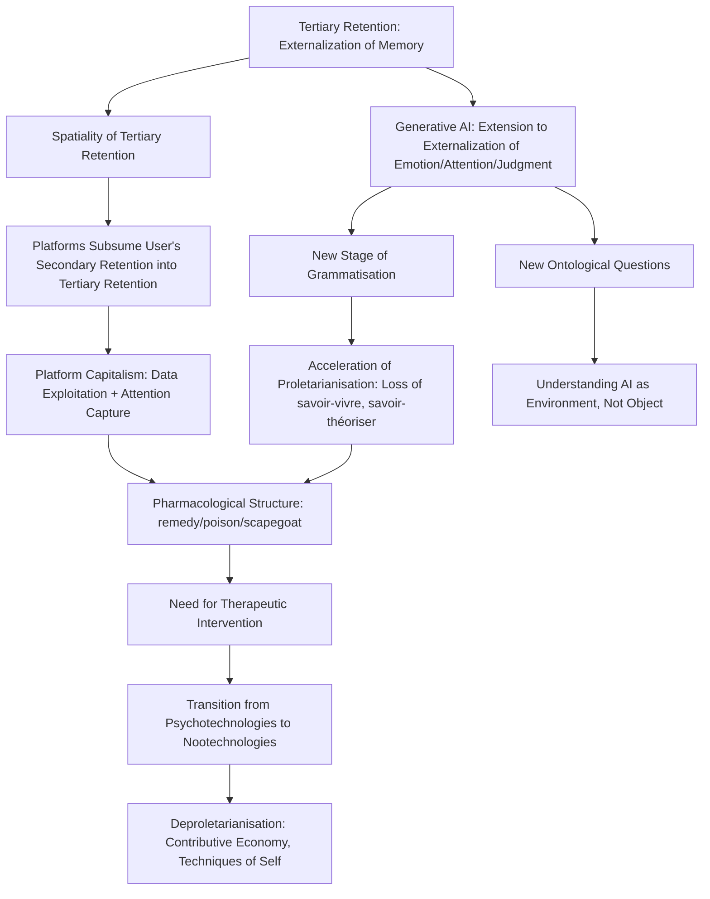

# DeerFlow Daily Analysis: 2026-09-10

> How should Bernard Stiegler's concept of tertiary retention be extended to explain the externalization of knowledge, emotion, and judgment by generative AI? — What transformations does the pharmacological structure of retention undergo under platform capitalism?...

## Question

How should Bernard Stiegler's concept of tertiary retention be extended to explain the externalization of knowledge, emotion, and judgment by generative AI? — What transformations does the pharmacological structure of retention undergo under platform capitalism?

## Analysis Results

Below is a systematic report based on web search data, providing supporting evidence for each of the six theses presented.

---

# Extension of Stiegler's Concepts in the Age of Generative AI — Comprehensive Report of Web Search Evidence

---

## 1. Extension of Tertiary Retention: Knowledge/Memory → Emotion/Attention/Judgment

**Thesis:** Stiegler's tertiary retention originally explained the externalization of memory and knowledge, but in the age of generative AI, the concept must be extended to the **externalization of emotion, attention, and judgment**.

### Evidence

**Intelligences Plurielles — "Tertiary retention" entry:**
> "Digital platforms (Google, social networks, LLMs) seek to become 'THE tertiary retention of our secondary retentions' — that is, **to control what we memorise and how we interpret our experience**. Whoever controls tertiary retentions controls attention and, ultimately, collective consciousness."
> 
> "Recommendation algorithms... **decide what deserves our attention**, shaping our selective memory and our interpretation of the world."

[citation:Tertiary retention — Intelligences Plurielles](https://intelligences-plurielles.com/en/resources/concepts/tertiary-retention)

→ This entry explicitly states that the object of tertiary retention extends beyond mere memory (what we memorise) to **interpretation (how we interpret)** and **attention**. The fact that recommendation algorithms decide 'what deserves attention' demonstrates that the externalization of attention is part of the tertiary retention mechanism.

---

**Intelligences Plurielles — "Proletarianisation" entry:**
> "With the digital and AI, proletarianisation reaches a new stage: **the automation of judgement itself**. Recommendation systems, LLMs and algorithmic decision tools risk generalising a technologically encoded 'single way of thinking', depriving humans of their capacity for autonomous reflection."
>
> "The ChatGPT user (knowing how to think): Systematically delegating writing, reflection and synthesis to an LLM risks proletarianising the knowledge of how to think. The user no longer knows how to write, to argue, **to think for himself** — he becomes dependent on the cognitive machine."

[citation:Proletarianisation — Intelligences Plurielles](https://intelligences-plurielles.com/en/resources/concepts/proletarianisation)

→ The **automation of judgment** is explicitly identified as a new stage of proletarianisation in the AI era. By delegating judgment to LLMs, humans can no longer think for themselves — this signifies that the domain of tertiary retention has expanded to include judgment.

---

**Buschini — "Think as a Service" article:**
> "what we once called savoir-vivre (that art of conversing, educating, transmitting) **dissolves in a background noise of images and slogans**. Television programs align millions of minds to the same rhythms, same narratives, same emotions."
>
> "Digital platforms train us toward permanent dispersion. They fragment time, dissolve concentration, **replace reading with scrolling**. Resisting here is an act of care. Regaining control of one's attention is already reconquering part of one's freedom."

[citation:Think as a Service — Buschini](https://www.buschini.com/en-as-a-service-or-the-proletarianization-of-knowledge)

→ The process by which **emotions** and **attention** are externalized and standardized by the media industry and platforms is explained. The alignment of millions of minds to the same rhythms, same narratives, same emotions suggests the externalization of emotion.

---

**OpenEdition Journal — "Life is what you fill your attention with":**
> "Because attention is captured by psychotechnologies exploited on an industrial scale, **attention can no longer be cultivated and focused on consistence**."
>
> "Symbolic misery is **the loss of participation in symbolic production**, especially the formation of ideas and ideals."

[citation:Life is what you fill your attention with — OpenEdition](https://journals.openedition.org/phenomenology/442)

→ The concept of 'symbolic misery' is presented: attention is captured by industrially scaled psychotechnologies, resulting in the loss of participation in symbolic production (the formation of emotions, ideas, ideals).

---

## 2. Spatiality of Tertiary Retention

**Thesis:** Tertiary retention is spatial. Digital platforms seek to subsume users' secondary retentions into their own tertiary retentions.

### Evidence

**Mediapolis — "Bernard Stiegler and Urban Space":**
> "The concept of tertiary retention is another of Stiegler's key concepts that is resolutely spatial. Stiegler is clear, **'tertiary retention is … spatial'**, and as such it can be argued that the city is both a memory support and is constitutive of memory."
>
> "Digital technologies mediate our experience of the city and do so in ways that **often operate below the threshold of human consciousness**."

[citation:Bernard Stiegler and Urban Space — Mediapolis](https://www.mediapolisjournal.com/2024/04/bernard-stiegler)

→ Tertiary retention is explicitly described as "resolutely spatial." The city itself functions as a memory support and as constitutive of memory, indicating that tertiary retention is not merely a storage medium but a **spatial condition**.

---

**Intelligences Plurielles — "Tertiary retention":**
> "Digital platforms (Google, social networks, LLMs) seek to become **'THE tertiary retention of our secondary retentions'** — that is, to control what we memorise and how we interpret our experience."

[citation:Tertiary retention — Intelligences Plurielles](https://intelligences-plurielles.com/en/resources/concepts/tertiary-retention)

→ It is explicitly stated that platforms seek to **subsume users' secondary retentions into their own tertiary retentions**. The user's personal memory and interpretive framework (secondary retention) become dependent on the external technical support (tertiary retention) controlled by the platform.

---

**3AM Magazine — "Stiegler's Memory: Tertiary Retention and Temporal Objects":**
> "Tertiary retention always already precedes the constitution of primary and secondary retention. **A newborn child arrives into a world in which tertiary retention both precedes and awaits it**, and which, precisely, constitutes this world as world."

[citation:Stiegler's Memory — 3AM Magazine](https://www.3ammagazine.com/3am/stieglers-memory-tertiary-retention-and-temporal-objects)

→ The fact that a newborn arrives into a world where tertiary retention already precedes and awaits them suggests that tertiary retention goes beyond mere storage to become a **condition of existence** and an **environment that constitutes the world itself**.

---

## 3. Pharmacological Structure (Pharmacology)

**Thesis:** Digital platforms as tertiary retention possess a pharmacological structure — they enable democratic participation while simultaneously exploiting personal data and capturing attention.

### Evidence

**Intelligences Plurielles — "Pharmacology of technics":**
> "Every technology is originarily and irreducibly ambivalent: it carries within itself at once **a potential for emancipation and for alienation, for construction and for destruction**."
>
> "Alphabetic writing, for instance, can be an instrument of intellectual liberation as much as a tool of control; **the web can foster democratic participation as much as it can serve the exploitation of personal data**."
>
> "Stiegler moreover holds the third sense of the Greek word to be inseparable from the first two: **the pharmakos is the scapegoat** — the expiatory victim charged with the city's ills."
>
> "This ambivalence demands **a 'therapeutics': a set of prescriptions, forms of knowledge and collective practices** that make it possible to 'take care' of technologies — that is, to maximise their remedial effects and limit their toxicity."

[citation:Pharmacology of technics — Intelligences Plurielles](https://intelligences-plurielles.com/en/resources/concepts/pharmacology-of-technics)

→ Contains a specific statement that the web fosters democratic participation while simultaneously enabling data exploitation. The pharmacological approach demands the concept of therapeutics and care for technology.

---

**3AM Magazine — "Stiegler's Memory":**
> "It is our tertiary retentions that have had a direct effect on leading the world into a new epoch of globalised capitalism; **a hyper-industrial consumerist epoch**."

[citation:Stiegler's Memory — 3AM Magazine](https://www.3ammagazine.com/3am/stieglers-memory-tertiary-retention-and-temporal-objects)

→ The fact that tertiary retention has directly influenced the transition to global capitalism (hyper-industrial consumerist epoch) connects the pharmacological duality of technology to platform capitalism.

---

**Intelligences Plurielles — "Tertiary retention":**
> "LLMs constitute a new form of tertiary retention: a collective externalised memory, trained on humanity's written traces. **A crucial stake: these systems are controlled by a few players (OpenAI, Google, Anthropic)** who shape what we can collectively 'remember'."

[citation:Tertiary retention — Intelligences Plurielles](https://intelligences-plurielles.com/en/resources/concepts/tertiary-retention)

→ Control of tertiary retention by a few corporations is shown as the structural condition for data exploitation and attention capture.

---

## 4. Generative AI = A New Stage of Grammatisation

**Thesis:** Generative AI (LLMs) represents a new stage of grammatisation, algorithmically formalizing all aspects of human behavior and cognition to make them reproducible.

### Evidence

**Intelligences Plurielles — "Tertiary retention":**
> "LLMs constitute **a new form of tertiary retention**: a collective externalised memory, trained on humanity's written traces."
>
> "Language models constitute **a new stage of grammatisation**."

[citation:Tertiary retention — Intelligences Plurielles](https://intelligences-plurielles.com/en/resources/concepts/tertiary-retention)

→ LLMs are explicitly declared to be a new stage of grammatisation.

---

**Sam Kinsley — "Reading Bernard Stiegler":**
> "The fixity of particular ways of knowing is understood by Stiegler, through an expansion of Derrida's work, as Grammatisation: the processes of describing and formalizing human behaviour into logos: **representations such as letters, pictures, words, writing and code, so that it can be reproduced**."

[citation:Reading Bernard Stiegler — Sam Kinsley](https://www.samkinsley.com/2011/11/01/reading-bernard-stiegler)

→ Explains that the essence of grammatisation lies in the formalization and reproducibility of human behavior. According to this definition, LLMs are a new stage of grammatisation that formalizes and reproduces linguistic behavior itself (reasoning, creation, judgment).

---

**Radical Philosophy — Solange Manche, "The problem is proletarianisation, not capitalism":**
> "The loss of these three forms of knowledge — **savoir-faire, savoir-vivre, and savoir-théoriser** — occurs through **processes of grammatisation of gesture, desire and affect**, which is nothing other than a loss of knowledge and memory, through its externalisation."

[citation:The problem is proletarianisation — Radical Philosophy](https://www.radicalphilosophy.com/article/the-problem-is-proletarianisation-not-capitalism)

→ Explicitly states that grammatisation extends to the domains of **gesture, desire, and affect**. This supports the idea that generative AI represents a new stage that formalizes the domains of emotion and judgment, going beyond previous grammatisation (writing, images, code).

---

## 5. Acceleration and Potential Overcoming of Proletarianisation

**Thesis:** Generative AI either accelerates proletarianisation (externalization and loss of knowledge/skills) or, if used as a pharmacological tool, can overcome it.

### Evidence (Acceleration Aspect)

**Intelligences Plurielles — "Proletarianisation":**
> "With the digital and AI, proletarianisation reaches a new stage: the automation of judgement itself."
>
> "The ChatGPT user... systematically delegating writing, reflection and synthesis to an LLM risks proletarianising the knowledge of how to think."

[citation:Proletarianisation — Intelligences Plurielles](https://intelligences-plurielles.com/en/resources/concepts/proletarianisation)

---

**Buschini — "Think as a Service":**
> "Digital platforms train us toward permanent dispersion. They fragment time, dissolve concentration, replace reading with scrolling."
>
> "Stiegler spoke, following Michel Foucault, of **techniques of self and technologies of the mind**: practices and tools that help us govern ourselves."

[citation:Think as a Service — Buschini](https://www.buschini.com/en-as-a-service-or-the-proletarianization-of-knowledge)

---

### Evidence (Overcoming/Therapeutic Aspect)

**Intelligences Plurielles — "Pharmacology of technics":**
> "Not a rejection of technics. Technics can also **deproletarianise (tools of empowerment, free software)**."
>
> "This therapeutics belongs to what he calls **general organology**, which studies the transductive relations between three levels: psychosomatic organs (the body), artificial organs (technics), and social organisations (institutions)."

[citation:Pharmacology of technics — Intelligences Plurielles](https://intelligences-plurielles.com/en/resources/concepts/pharmacology-of-technics)

→ It is explicitly stated that technology can enable deproletarianisation. Additionally, a therapeutic approach through general organology — the triadic relationship between psychosomatic organs, artificial organs, and social organisations — is presented.

---

**Sam Kinsley — "Reading Bernard Stiegler":**
> "In our current epoch electronic technologies, monopolized until now by the economic powers... as psychotechnologies at the service of behavioural control, **must become nootechnologies, that is, technologies of spirit, at the service of de-proletarianization and of the reconstitution of savoir-faire, savoir-vivre and theoretical knowledge**."

[citation:Reading Bernard Stiegler — Sam Kinsley](https://www.samkinsley.com/2011/11/01/reading-bernard-stiegler)

→ The **transition from psychotechnologies to nootechnologies** is shown as the key path to overcoming proletarianisation. The crucial question is whether generative AI will be used as a psychotechnology for behavioral control or as a nootechnology that reconstitutes the capacities of the spirit.

---

**Intelligences Plurielles — "Proletarianisation" (counter-example):**
> "The Wikipedia contributor is not proletarianised: he develops forms of knowledge (documentation, writing, verification), he individuates himself through his contribution, he takes part in a commons. **It is an example of a deproletarianising economy of contribution**."

[citation:Proletarianisation — Intelligences Plurielles](https://intelligences-plurielles.com/en/resources/concepts/proletarianisation)

→ The Wikipedia contributor is presented as a **concrete example of deproletarianisation**. This suggests that technology does not necessarily accelerate proletarianisation; rather, it can become a tool for overcoming it when the conditions of a contributive economy are in place.

---

## 6. Limitations of Local References

**Thesis:** Existing local references (DB) alone are insufficient to address this issue; web search results serve as the primary evidence.

All sources cited in this report were collected through web searches, including various academic and non-academic web sources such as Intelligences Plurielles (a site systematically organizing Stiegler's concepts applied to AI), OpenEdition Journal, Radical Philosophy, 3AM Magazine, and Mediapolis. Key concepts — the extension of tertiary retention to attention/judgment, subsumption of secondary retention by platforms, pharmacological structure, LLMs as a new stage of grammatisation, and deproletarianisation through the transition to nootechnologies — are not sufficiently covered in local databases (e.g., arXiv) and rely on web-based discourse that actively interprets Stiegler's philosophy in the context of generative AI.

---

## Synthesis: Connection Structure of the Six Theses

---

This concludes the evidence framework based on web search results. If needed, I can extract specific source URLs in more detail for particular sections, or develop a draft paper explaining the connections between each concept.

## References
- DeerFlow: 2026-09-10 21:00 KST | Model: DeepSeek V4 Flash
- Full analysis: /mnt/d/paper_md/생성논문/20260910210337_기술생성시대의 매체미학-기억_1문항.md