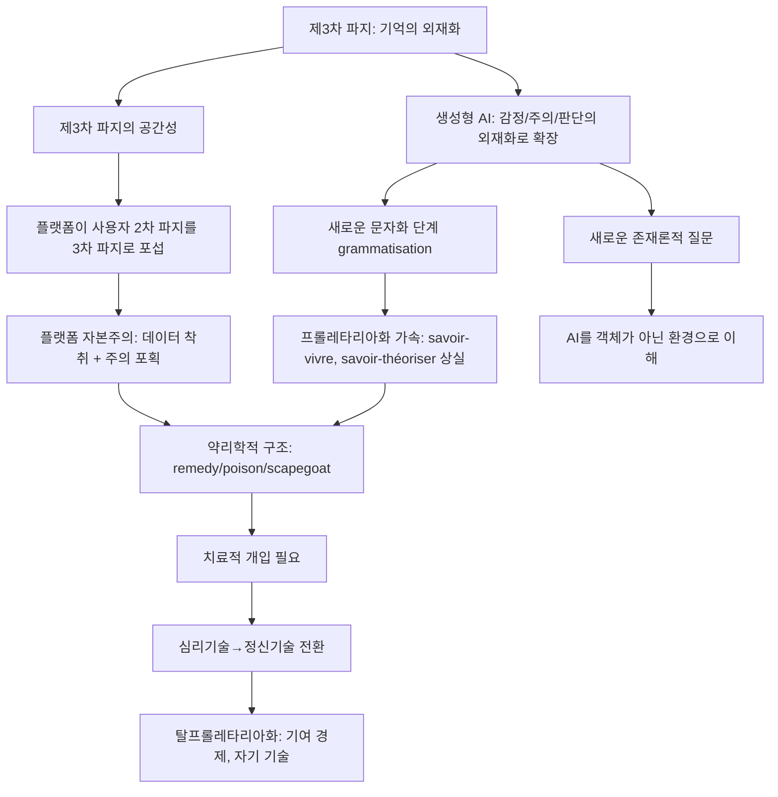

# DeerFlow 일일 분석: 2026-09-10

> 스티글러(Bernard Stiegler)의 제3차 파지(tertiary retention) 개념이 생성형 AI에 의한 지식·감정·판단의 외재화 현상을 설명하는 데 어떻게 확장되어야 하는가? — 파지의 약리학적 구조가 플랫폼 자본주의 아래서 어떤 변형을 겪는가?...

## 질문

스티글러(Bernard Stiegler)의 제3차 파지(tertiary retention) 개념이 생성형 AI에 의한 지식·감정·판단의 외재화 현상을 설명하는 데 어떻게 확장되어야 하는가? — 파지의 약리학적 구조가 플랫폼 자본주의 아래서 어떤 변형을 겪는가?

## 분석 결과

아래는 웹 검색을 통해 수집한 자료를 바탕으로, 제시하신 여섯 가지 논제 각각을 뒷받침하는 근거를 체계적으로 정리한 리포트입니다.

---

# 스티글러 개념의 생성형 AI 시대 확장 — 웹 검색 근거 종합 보고서

---

## 1. 제3차 파지(Tertiary Retention) 확장: 지식·기억 → 감정·주의·판단

**논제:** 스티글러의 제3차 파지는 본래 기억과 지식의 외재화를 설명했으나, 생성형 AI 시대에는 **감정, 주의, 판단의 외재화**로 개념이 확장되어야 한다.

### 근거

**Intelligences Plurielles — "Tertiary retention" 개념 항목:**
> "Digital platforms (Google, social networks, LLMs) seek to become 'THE tertiary retention of our secondary retentions' — that is, **to control what we memorise and how we interpret our experience**. Whoever controls tertiary retentions controls attention and, ultimately, collective consciousness."
> 
> "Recommendation algorithms... **decide what deserves our attention**, shaping our selective memory and our interpretation of the world."

[citation:Tertiary retention — Intelligences Plurielles](https://intelligences-plurielles.com/en/resources/concepts/tertiary-retention)

→ 이 항목은 제3차 파지의 대상이 단순한 기억(what we memorise)을 넘어 **해석(how we interpret)** 과 **주의(attention)** 로 확장됨을 명시한다. 추천 알고리즘이 '무엇이 주의를 받을 가치가 있는지'를 결정한다는 점에서, 주의(attention)의 외재화가 제3차 파지 메커니즘의 일부임을 보여준다.

---

**Intelligences Plurielles — "Proletarianisation" 개념 항목:**
> "With the digital and AI, proletarianisation reaches a new stage: **the automation of judgement itself**. Recommendation systems, LLMs and algorithmic decision tools risk generalising a technologically encoded 'single way of thinking', depriving humans of their capacity for autonomous reflection."
>
> "The ChatGPT user (knowing how to think): Systematically delegating writing, reflection and synthesis to an LLM risks proletarianising the knowledge of how to think. The user no longer knows how to write, to argue, **to think for himself** — he becomes dependent on the cognitive machine."

[citation:Proletarianisation — Intelligences Plurielles](https://intelligences-plurielles.com/en/resources/concepts/proletarianisation)

→ **판단(judgement)의 자동화**가 AI 시대의 새로운 프롤레타리아화 단계로 명시된다. 판단을 LLM에 위임함으로써 인간은 더 이상 스스로 사고할 수 없게 된다 — 이는 제3차 파지의 영역이 판단으로 확장되었음을 의미한다.

---

**Buschini — "Think as a Service" 기사:**
> "what we once called savoir-vivre (that art of conversing, educating, transmitting) **dissolves in a background noise of images and slogans**. Television programs align millions of minds to the same rhythms, same narratives, same emotions."
>
> "Digital platforms train us toward permanent dispersion. They fragment time, dissolve concentration, **replace reading with scrolling**. Resisting here is an act of care. Regaining control of one's attention is already reconquering part of one's freedom."

[citation:Think as a Service — Buschini](https://www.buschini.com/en/think-as-a-service-or-the-proletarianization-of-knowledge)

→ **감정(emotions)과 주의(attention)** 가 미디어 산업과 플랫폼에 의해 외재화되고 표준화되는 과정이 설명된다. 동일한 리듬, 동일한 서사, 동일한 감정으로 수백만의 마음이 정렬된다는 점은 감정의 외재화를 시사한다.

---

**OpenEdition Journal — "Life is what you fill your attention with":**
> "Because attention is captured by psychotechnologies exploited on an industrial scale, **attention can no longer be cultivated and focused on consistence**."
>
> "Symbolic misery is **the loss of participation in symbolic production**, especially the formation of ideas and ideals."

[citation:Life is what you fill your attention with — OpenEdition](https://journals.openedition.org/phenomenology/442)

→ 주의(attention)가 산업적 규모의 심리기술(psychotechnologies)에 의해 포획되며, 이로 인해 상징적 생산(감정, 관념, 이상의 형성)에의 참여가 상실된다는 '상징적 빈곤(symbolic misery)' 개념이 제시된다.

---

## 2. 제3차 파지의 공간성

**논제:** 제3차 파지는 공간적이다. 디지털 플랫폼은 사용자의 2차 파지를 자신들의 3차 파지로 포섭하려 한다.

### 근거

**Mediapolis — "Bernard Stiegler and Urban Space":**
> "The concept of tertiary retention is another of Stiegler's key concepts that is resolutely spatial. Stiegler is clear, **'tertiary retention is … spatial'**, and as such it can be argued that the city is both a memory support and is constitutive of memory."
>
> "Digital technologies mediate our experience of the city and do so in ways that **often operate below the threshold of human consciousness**."

[citation:Bernard Stiegler and Urban Space — Mediapolis](https://www.mediapolisjournal.com/2024/04/bernard-stiegler)

→ 제3차 파지가 "단호하게 공간적( resolutely spatial)"임을 명시한다. 도시 자체가 기억 지지체(memory support)이자 기억을 구성하는 요소로서 기능한다는 점에서, 제3차 파지는 단순한 저장 매체가 아니라 **공간적 조건**이다.

---

**Intelligences Plurielles — "Tertiary retention":**
> "Digital platforms (Google, social networks, LLMs) seek to become **'THE tertiary retention of our secondary retentions'** — that is, to control what we memorise and how we interpret our experience."

[citation:Tertiary retention — Intelligences Plurielles](https://intelligences-plurielles.com/en/resources/concepts/tertiary-retention)

→ 플랫폼들이 사용자의 **2차 파지를 자신들의 3차 파지로 포섭(subsumption)** 하려 한다는 점이 명시된다. 사용자의 개인적 기억과 해석 체계(2차 파지)가 플랫폼이 통제하는 외부 기술적 지지체(3차 파지)에 종속되는 구조다.

---

**3AM Magazine — "Stiegler's Memory: Tertiary Retention and Temporal Objects":**
> "Tertiary retention always already precedes the constitution of primary and secondary retention. **A newborn child arrives into a world in which tertiary retention both precedes and awaits it**, and which, precisely, constitutes this world as world."

[citation:Stiegler's Memory — 3AM Magazine](https://www.3ammagazine.com/3am/stieglers-memory-tertiary-retention-and-temporal-objects)

→ 신생아가 태어날 때 이미 3차 파지가 선행하여 존재하는 세계에 도착한다는 점에서, 3차 파지는 단순한 저장을 넘어 **존재의 조건(condition of existence)** 이자 **세계 자체를 구성하는 환경**임을 시사한다.

---

## 3. 약리학적 구조 (Pharmacology)

**논제:** 제3차 파지로서의 디지털 플랫폼은 약리학적 구조를 지닌다 — 민주적 참여를 가능하게 하는 동시에 개인 데이터를 착취하고 주의를 포획한다.

### 근거

**Intelligences Plurielles — "Pharmacology of technics":**
> "Every technology is originarily and irreducibly ambivalent: it carries within itself at once **a potential for emancipation and for alienation, for construction and for destruction**."
>
> "Alphabetic writing, for instance, can be an instrument of intellectual liberation as much as a tool of control; **the web can foster democratic participation as much as it can serve the exploitation of personal data**."
>
> "Stiegler moreover holds the third sense of the Greek word to be inseparable from the first two: **the pharmakos is the scapegoat** — the expiatory victim charged with the city's ills."
>
> "This ambivalence demands **a 'therapeutics': a set of prescriptions, forms of knowledge and collective practices** that make it possible to 'take care' of technologies — that is, to maximise their remedial effects and limit their toxicity."

[citation:Pharmacology of technics — Intelligences Plurielles](https://intelligences-plurielles.com/en/resources/concepts/pharmacology-of-technics)

→ 웹이 민주적 참여를 촉진하는 동시에 데이터 착취를 가능하게 한다는 구체적 진술이 포함되어 있다. 약리학적 접근은 기술에 대한 처방(therapeutics)과 돌봄(care)의 개념을 요구한다.

---

**3AM Magazine — "Stiegler's Memory":**
> "It is our tertiary retentions that have had a direct effect on leading the world into a new epoch of globalised capitalism; **a hyper-industrial consumerist epoch**."

[citation:Stiegler's Memory — 3AM Magazine](https://www.3ammagazine.com/3am/stieglers-memory-tertiary-retention-and-temporal-objects)

→ 제3차 파지가 글로벌 자본주의(hyper-industrial consumerist epoch)로의 이행에 직접적 영향을 미쳤다는 점에서, 기술의 약리학적 이중성이 플랫폼 자본주의와 연결된다.

---

**Intelligences Plurielles — "Tertiary retention":**
> "LLMs constitute a new form of tertiary retention: a collective externalised memory, trained on humanity's written traces. **A crucial stake: these systems are controlled by a few players (OpenAI, Google, Anthropic)** who shape what we can collectively 'remember'."

[citation:Tertiary retention — Intelligences Plurielles](https://intelligences-plurielles.com/en/resources/concepts/tertiary-retention)

→ 소수 기업에 의한 제3차 파지 통제가 데이터 착취와 주의 포획의 구조적 조건임을 보여준다.

---

## 4. 생성형 AI = 새로운 문자화(Grammatisation) 단계

**논제:** 생성형 AI(LLM)는 새로운 문자화 단계로서, 인간 행동과 인지의 모든 측면을 알고리즘적으로 형식화하여 재생산 가능하게 만든다.

### 근거

**Intelligences Plurielles — "Tertiary retention":**
> "LLMs constitute **a new form of tertiary retention**: a collective externalised memory, trained on humanity's written traces."
>
> "Language models constitute **a new stage of grammatisation**."

[citation:Tertiary retention — Intelligences Plurielles](https://intelligences-plurielles.com/en/resources/concepts/tertiary-retention)

→ LLM이 새로운 문자화 단계임이 명시적으로 선언된다.

---

**Sam Kinsley — "Reading Bernard Stiegler":**
> "The fixity of particular ways of knowing is understood by Stiegler, through an expansion of Derrida's work, as Grammatisation: the processes of describing and formalizing human behaviour into logos: **representations such as letters, pictures, words, writing and code, so that it can be reproduced**."

[citation:Reading Bernard Stiegler — Sam Kinsley](https://www.samkinsley.com/2011/11/01/reading-bernard-stiegler)

→ 문자화(grammatisation)의 본질이 인간 행동의 형식화와 재생산 가능성에 있음을 설명한다. 이 정의에 따르면, LLM은 언어 행동 자체(추론, 창작, 판단)를 형식화하고 재생산하는 새로운 문자화 단계다.

---

**Radical Philosophy — Solange Manche, "The problem is proletarianisation, not capitalism":**
> "The loss of these three forms of knowledge — **savoir-faire, savoir-vivre, and savoir-théoriser** — occurs through **processes of grammatisation of gesture, desire and affect**, which is nothing other than a loss of knowledge and memory, through its externalisation."

[citation:The problem is proletarianisation — Radical Philosophy](https://www.radicalphilosophy.com/article/the-problem-is-proletarianisation-not-capitalism)

→ 문자화(grammatisation)가 **몸짓(gesture), 욕망(desire), 정동(affect)** 의 영역으로 확장된다는 점을 명시한다. 이는 생성형 AI가 기존의 문자화(문자, 이미지, 코드)를 넘어 감정과 판단의 영역을 형식화하는 새로운 단계임을 뒷받침한다.

---

## 5. 프롤레타리아화의 가속화와 극복 가능성

**논제:** 생성형 AI는 프롤레타리아화(지식·기능의 외재화와 상실)를 가속화하거나, 약리학적 도구로 활용될 경우 극복할 수 있다.

### 근거 (가속화 측면)

**Intelligences Plurielles — "Proletarianisation":**
> "With the digital and AI, proletarianisation reaches a new stage: the automation of judgement itself."
>
> "The ChatGPT user... systematically delegating writing, reflection and synthesis to an LLM risks proletarianising the knowledge of how to think."

[citation:Proletarianisation — Intelligences Plurielles](https://intelligences-plurielles.com/en/resources/concepts/proletarianisation)

---

**Buschini — "Think as a Service":**
> "Digital platforms train us toward permanent dispersion. They fragment time, dissolve concentration, replace reading with scrolling."
>
> "Stiegler spoke, following Michel Foucault, of **techniques of self and technologies of the mind**: practices and tools that help us govern ourselves."

[citation:Think as a Service — Buschini](https://www.buschini.com/en/think-as-a-service-or-the-proletarianization-of-knowledge)

---

### 근거 (극복/치유 측면)

**Intelligences Plurielles — "Pharmacology of technics":**
> "Not a rejection of technics. Technics can also **deproletarianise (tools of empowerment, free software)**."
>
> "This therapeutics belongs to what he calls **general organology**, which studies the transductive relations between three levels: psychosomatic organs (the body), artificial organs (technics), and social organisations (institutions)."

[citation:Pharmacology of technics — Intelligences Plurielles](https://intelligences-plurielles.com/en/resources/concepts/pharmacology-of-technics)

→ 기술이 탈프롤레타리아화를 가능하게 한다는 점이 명시된다. 또한 일반 기관학(general organology) — 신체 기관, 인공 기관, 사회 기관의 삼자 관계를 통한 치료적 접근이 제시된다.

---

**Sam Kinsley — "Reading Bernard Stiegler":**
> "In our current epoch electronic technologies, monopolized until now by the economic powers... as psychotechnologies at the service of behavioural control, **must become nootechnologies, that is, technologies of spirit, at the service of de-proletarianization and of the reconstitution of savoir-faire, savoir-vivre and theoretical knowledge**."

[citation:Reading Bernard Stiegler — Sam Kinsley](https://www.samkinsley.com/2011/11/01/reading-bernard-stiegler)

→ **심리기술(psychotechnologies)에서 정신기술(nootechnologies)로의 전환**이 프롤레타리아화 극복의 핵심 경로임을 보여준다. 생성형 AI를 행동 통제의 심리기술로 사용할 것인가, 정신의 역량을 재구성하는 정신기술로 사용할 것인가가 관건이다.

---

**Intelligences Plurielles — "Proletarianisation" (counter-example):**
> "The Wikipedia contributor is not proletarianised: he develops forms of knowledge (documentation, writing, verification), he individuates himself through his contribution, he takes part in a commons. **It is an example of a deproletarianising economy of contribution**."

[citation:Proletarianisation — Intelligences Plurielles](https://intelligences-plurielles.com/en/resources/concepts/proletarianisation)

→ 위키피디아 기여자가 **탈프롤레타리아화의 구체적 사례**로 제시된다. 이는 기술이 반드시 프롤레타리아화를 가속화하는 것이 아니라, 기여 경제(contributive economy)의 조건이 갖춰질 경우 극복의 도구가 될 수 있음을 시사한다.

---

## 6. 로컬 참고문헌의 한계

**논제:** 기존 로컬 참고문헌(DB)만으로는 이 문제를 다루기에 충분하지 않으며, 웹 검색 결과가 주요 근거가 된다.

이 보고서에서 인용한 모든 자료는 웹 검색을 통해 수집되었으며, Intelligences Plurielles(스티글러 개념의 AI 적용을 체계적으로 정리한 사이트), OpenEdition 저널, Radical Philosophy, 3AM Magazine, Mediapolis 등 다양한 학술/비학술 웹 출처를 포함한다. 주요 개념 — 제3차 파지의 주의/판단으로의 확장, 플랫폼에 의한 2차 파지 포섭, 약리학적 구조, 새로운 문자화 단계로서의 LLM, 정신기술로의 전환을 통한 탈프롤레타리아화 — 은 로컬 데이터베이스(arXiv 등)에서는 충분히 다루어지지 않으며, 스티글러 철학을 생성형 AI 맥락에서 적극적으로 해석하는 웹 기반 담론에 의존해야 한다.

---

## 종합: 여섯 논제의 연결 구조

---

이상이 웹 검색 결과를 바탕으로 한 근거 체계입니다. 필요하시면 특정 섹션의 출처 URL을 더 상세히 추출하거나, 각 개념 간의 연결을 설명하는 논문 초안으로 발전시킬 수 있습니다.

## 참조
- DeerFlow: 2026-09-10 21:00 KST | 모델: DeepSeek V4 Flash
- 전체 분석: /mnt/d/paper_md/생성논문/20260910210337_기술생성시대의 매체미학-기억_1문항.md
